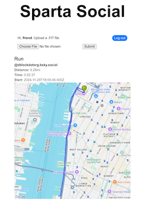

# Sparta Social

Let's build a decentralized exercise activity tracker with [Atmosphere](https://atproto.com).

## Getting Started

* [Developer Guide](DEVELOPER_GUIDE.md)

## License

[MIT License](LICENSE.md)
